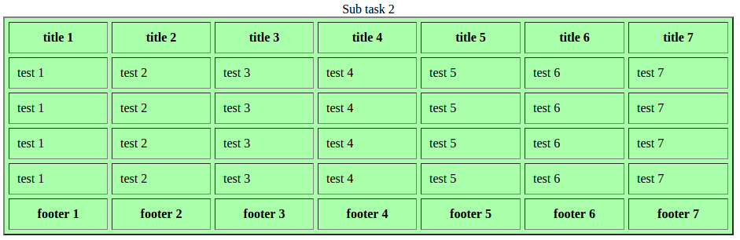
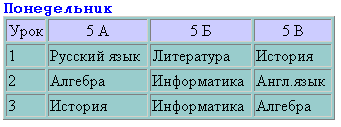
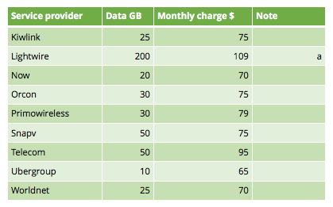
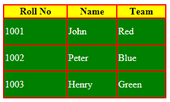
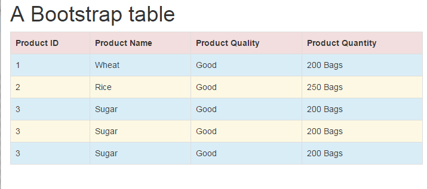
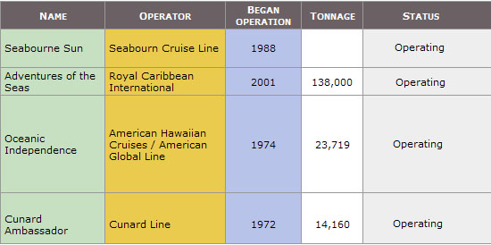

# task 2: Tables introduction

---

## Sub task 1

Разобраться как с основами таблиц. Создать простую таблицу.
Разобрать теги:
```html
<table>

<tr>
<td>
```

Сделать таблицу только без шапки и футера.  


## Sub task 2

Дополнительные теги таблицы

```
caption

<thead>
<tbody>
<tfoot>

<th>
```

Сделать таблицу:



## Sub task 3

Разобраться с основными html атрибутами для стилизации таблицы.
```
cellpadding
cellspacing
border
width
align
color
```

Сделать таблицы:

#### Sub task 2-3-1


#### Sub task 2-3-2


#### Sub task 2-3-3


#### Sub task 2-3-4


#### Sub task 2-3-5


#### Sub task 2-3-6


#### Sub task 2-3-7


#### Sub task 2-3-8


#### Sub task 2-3-9

