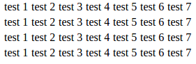

# task 2: Tables introduction

---

## Sub task 1

Разобраться как с основами таблиц. Создать простую таблицу.
Разобрать теги:
```html
<table>

<thead>
<tbody>
<tfoot>

<tr>
<th>
<td>
```

Сделать такую таблицу:

