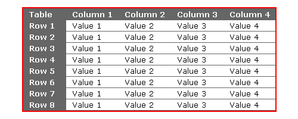

# task 2: Tables introduction

---

## Sub task 1

Разобраться как с основами таблиц. Создать простую таблицу.
Разобрать теги:
```html
<table>

<tr>
<td>
```

Сделать таблицу только без шапки и футера.  


## Sub task 2

Дополнительные теги таблицы

```html
caption

<thead>
<tbody>
<tfoot>

<th>
```

Сделать таблицу:


## Sub task 3

Разобраться с основными html атрибутами для стилизации таблицы.
```
cellpadding
cellspacing
border
bordercolor
width
align
color
```

**Сделать следующие таблицы:**  

*Примечания:*

- точные код цвета можно узнать загрузив картинку в редактор ms paint при помощи инструмента пипетка
- на стиль шрифтов(с засечками или без) не обращай внимания
- жирность шрифтов и выравнивание важны!
- использовать thead/tbody/tfoot там где в таблице есть шапка
- цвет заливки, цвет важны. Но не обязательно точно соблюдать цвет, можно на глаз
- толщина границ и их цвет важны
- размеры внешних и внутренних отступов важны
- выравнивание: лево, право, центр важно

#### Sub task 2-3-1


#### Sub task 2-3-2


#### Sub task 2-3-3


#### Sub task 2-3-4


#### Sub task 2-3-5


#### Sub task 2-3-6


#### Sub task 2-3-7


#### Sub task 2-3-8


#### Sub task 2-3-9


#### Sub task 4

Сделать самому 2 **красивые** *(на сколько получится)* таблицы.

1. Таблица выученных html тегов.  

   Колонки:

   - тег
   - вложен в (список тегов внутри которых он может быть вложен)
   - обязателен? да/нет
   - описание

2. таблица выученных html аттрибутов  

   Колонки:
   
   - название
   - применим к тегам (список тегов)
   - Присутствует в html5? да/нет
   - описаниие
